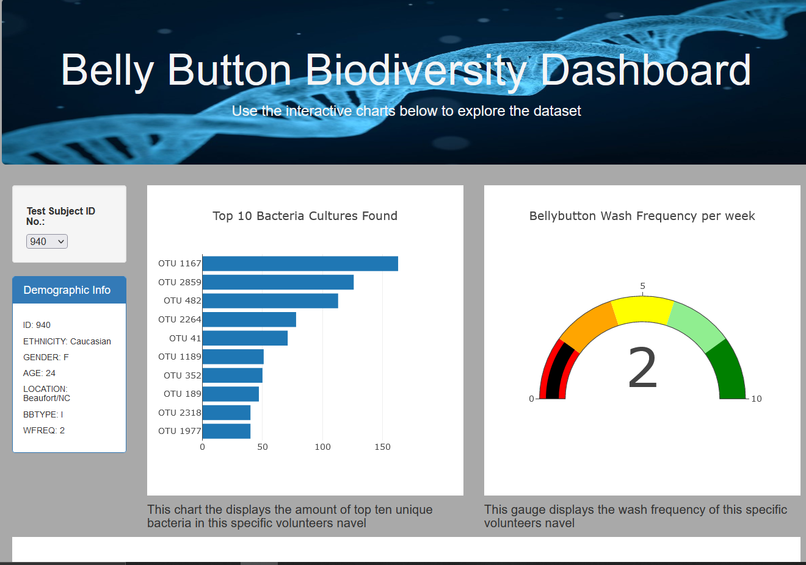

# plotly_deploy

### Purpose
  The purpose of this exercise was to visualize data namely through a website using Plotly library and Javascript. The data would be provided through a Json file and be read into a javascript file using D3. The Javascript file would contain all the analysis using .map(), .fitler(), and .sort() methods provided in the Plotly library. Then the js.file would be called in into an html file to display the site over github pages.
  
  ### Example
  
